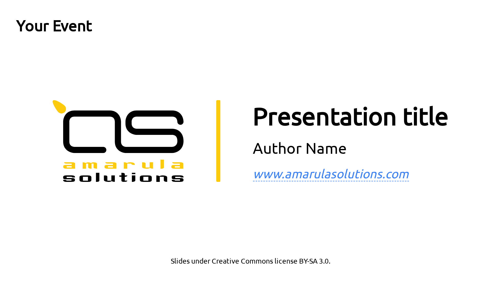
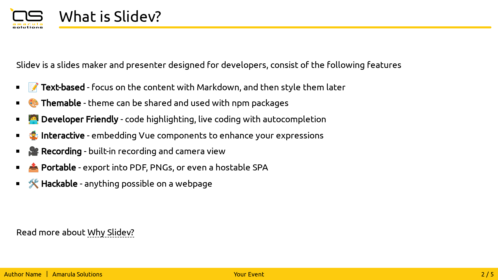

# slidev-theme-amarula

Amarula Solutions theme for [Slidev](https://github.com/slidevjs/slidev).

## Install

Clone as submodule the `slidev-theme-amarula` inside your Slidev presentation.

Then add the following frontmatter to your `slides.md`.

<pre><code>---
theme: <b>./slidev-theme-amarula</b>
---</code></pre>

Learn more about [how to use a theme](https://sli.dev/guide/theme-addon#use-theme).

## Layouts

This theme provides the following layouts:

### Cover



| **Parameter** | **Type**                          | **Default**                       | **Notes**                                              |
| ------------- | --------------------------------- | --------------------------------- | ------------------------------------------------------ |
| `title`       | `string`                          | `''` (empty string)               | Title of the presentation                              |
| `author`      | `string`                          | `''` (empty string)               | Authors of the presentation                            |
| `event`       | `string`                          | `''` (empty string)               | Event where the presentation is showed                 |

### Default



This is the layout with a top and bottom bars and the company logo left to the title,
trying to give a structured approach to displaying slide information consistently across the presentation..

To achieve this rendering the slide page must be created as follow:

```md
---

::title::

Page Title

::body::

Page Body
```

## Contributing

- `pnpm install`
- `pnpm dev` to start theme preview of `example.md`
- Edit the `example.md` and style to see the changes
- `pnpm export` to generate the preview PDF
- `pnpm screenshot` to generate the preview PNG
